# VR_Assignment1_GarvitSingla_MS2024009

In this assignment two main functonalities are used:

1. Coin Detection and Analysis : a. For edge detection canny edge detector is used and for identifing the coins Hough circles is used.
                                 b. Further for Segmentation Otsu's thresholding for regions, morphological operations to remove noise
                                  and fill gaps, distance transform to determine foreground areas and watershed algorithm to segregate 
                                  the overlapping images was used to segment the coins.
                                 c. Moreover for coins count contour detection and drawing bounding boxes was performed.

2. Image Stitching : Used SIFT feature detection for key points identification, FLANN-based matching as well as homograpy to match the 
                    key points while eliminating outliers and further by warping and blending the panaroma is created.

Requirements to run the code are :
 opencv
 numpy
 matplotlib
 (Install the required packages using pip)

Running the code:
1. For coin_detection - run the file named Coin_detection_and_segmentation.py while specifying the image path in the working directory
 on which operations are applied. 

 The results displays -
    - grayscale image showing edges detected using the Canny method 
     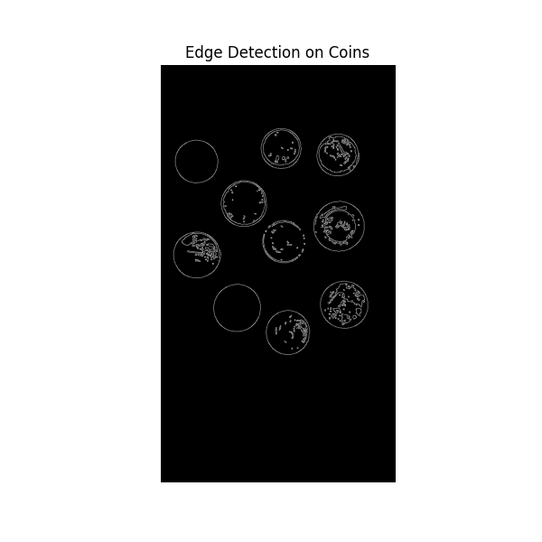
    - Circles around coins using Hough Transform 
     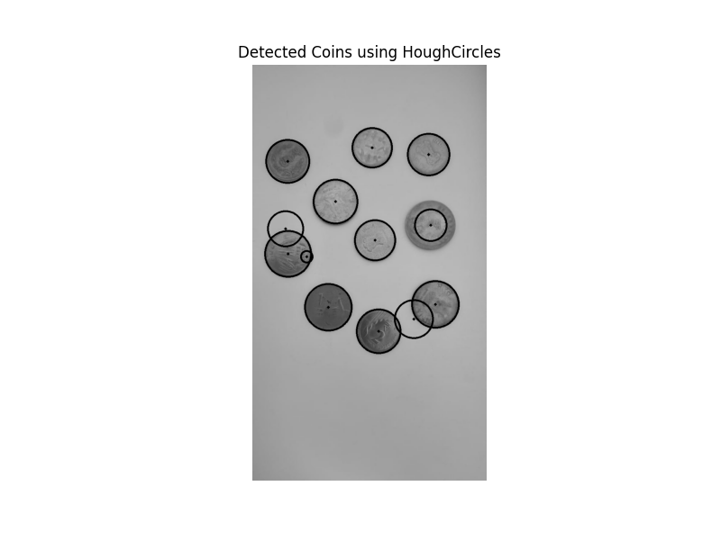
    - Coins Segmentation and displayed images of individual coins 
     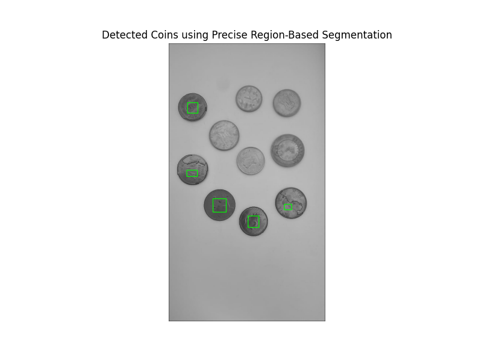
     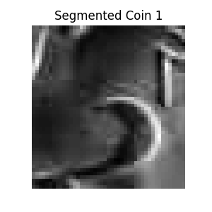
     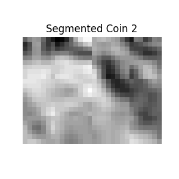
     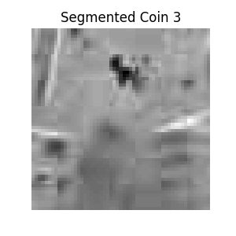
     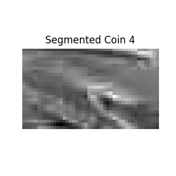
     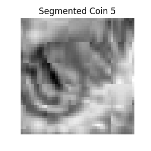
    - Counting of coins with bounding boxes on each coin. 
     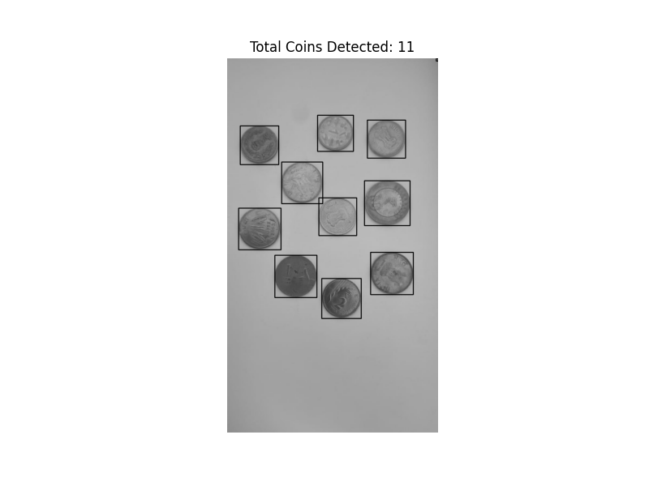

Observations - 
    A proper display of each coin is observed with boundary under the grayscale and all the segmented coins are identified.

2. For Image_Stiching - run the file named Panorma_creation.py while specifying images with left_image -> pano1, 
 middle_image -> pano2 and right_image-> pano3 and according putting their path with .jpg extention in the script and run it.

The results displays:
    - The keypoints are plotted using SIFT detection under each image (left, ref, right) 
    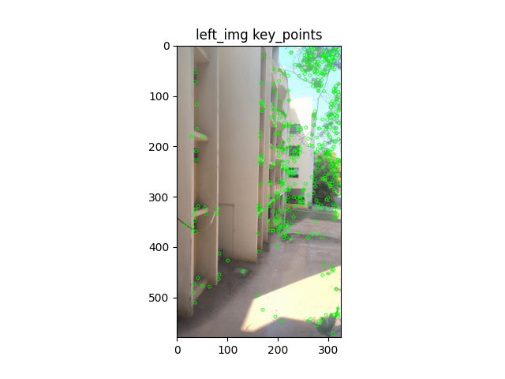
    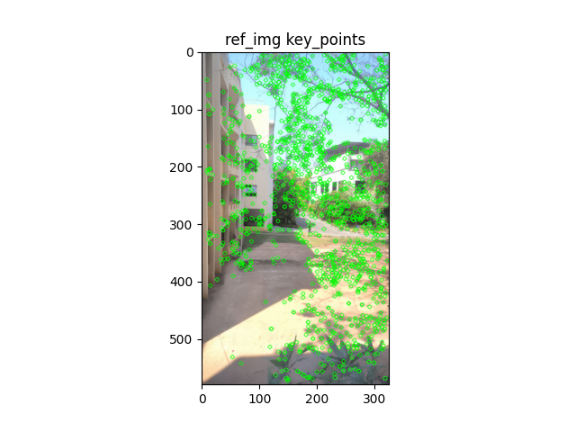
    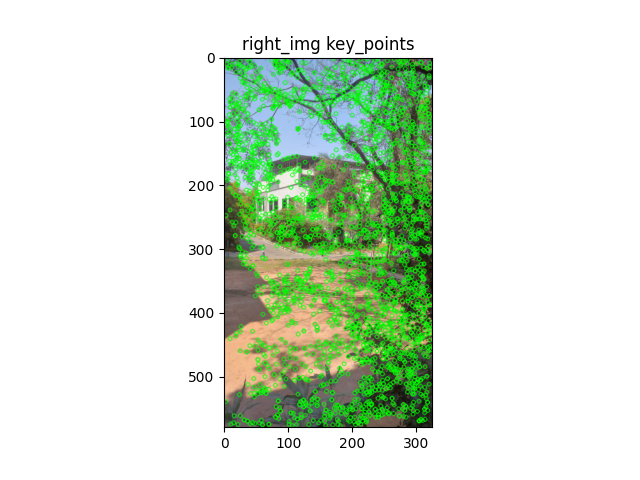
    - Using Homography the matching descriptors on overlapping images are found 
    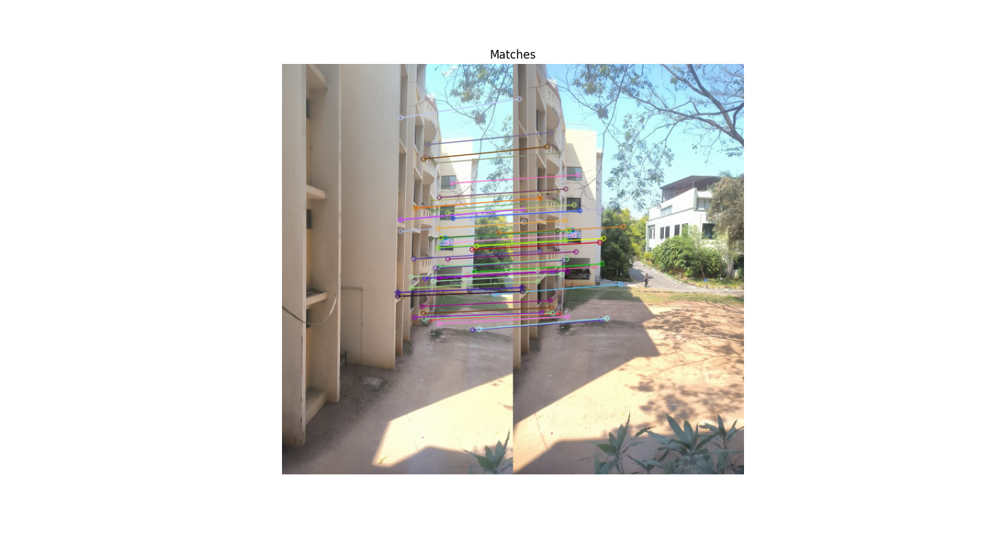
    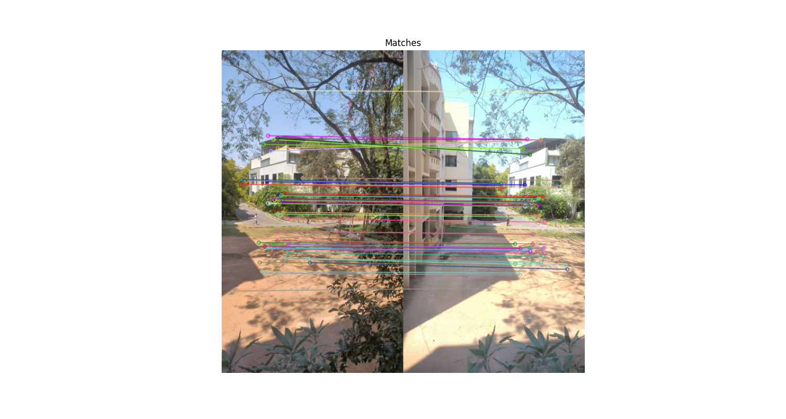
    Finally Using Warping and Blending common coordinate space can be found using the estimated homographies and hence merged to create a panorama
    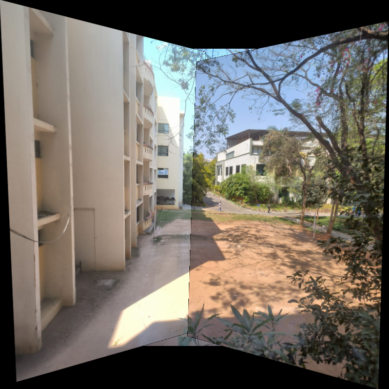

Observations:
    Full panaroma is created by using the 3 different images with proper matching of keypoints among all images is formed.

